# Wayne's Retro Arcade

A collection of 18 classic arcade games built entirely with HTML5 Canvas and vanilla JavaScript. No frameworks, no dependencies — just open `index.html` in a browser and play.

**Live:** [waynetd777.github.io/arcade-games](https://waynetd777.github.io/arcade-games/)

<p align="center">
  
  <br>
  <sub>Scan to play on your phone</sub>
</p>

## Games

<p align="center">
  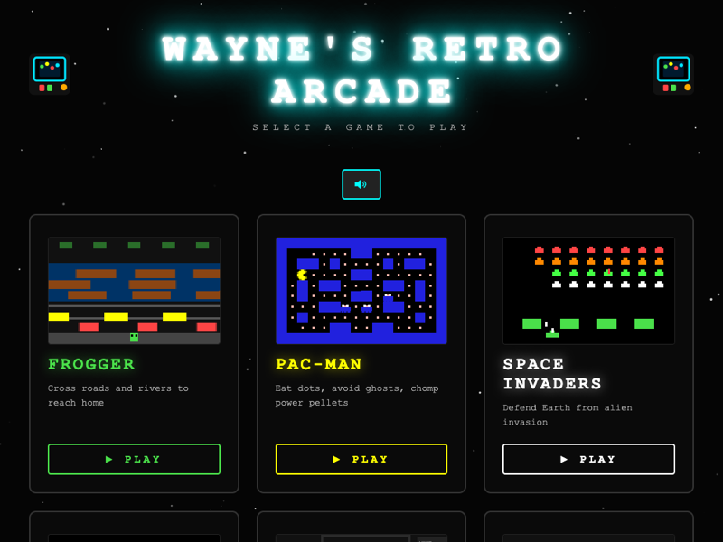
</p>

<table>
<tr>
<td align="center" width="33%">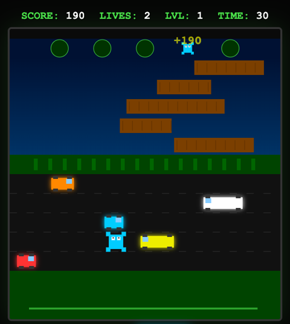<br><b>Frogger</b><br><sub>Cross roads and rivers to reach home</sub></td>
<td align="center" width="33%">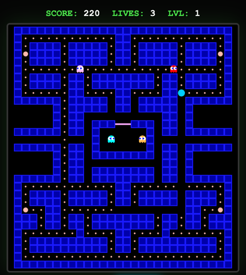<br><b>Pac-Man</b><br><sub>Eat dots, avoid ghosts, chomp power pellets</sub></td>
<td align="center" width="33%">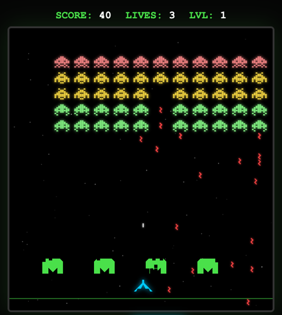<br><b>Space Invaders</b><br><sub>Defend Earth from alien invasion</sub></td>
</tr>
<tr>
<td align="center" width="33%">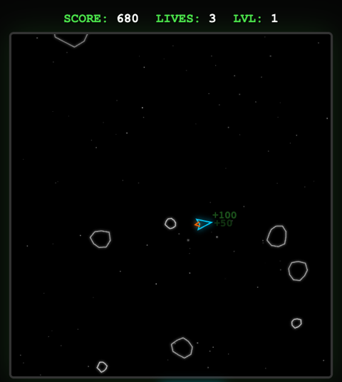<br><b>Asteroids</b><br><sub>Navigate and blast through asteroid fields</sub></td>
<td align="center" width="33%">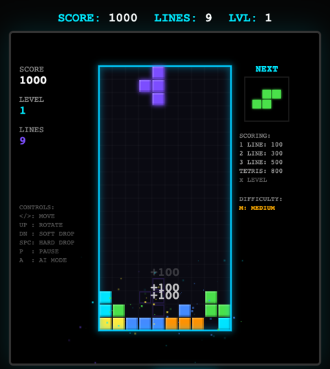<br><b>Tetris</b><br><sub>Stack falling blocks, clear lines</sub></td>
<td align="center" width="33%">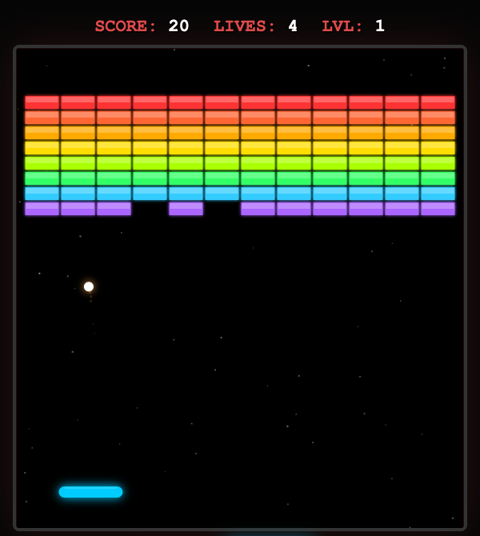<br><b>Breakout</b><br><sub>Smash bricks with a bouncing ball</sub></td>
</tr>
<tr>
<td align="center" width="33%">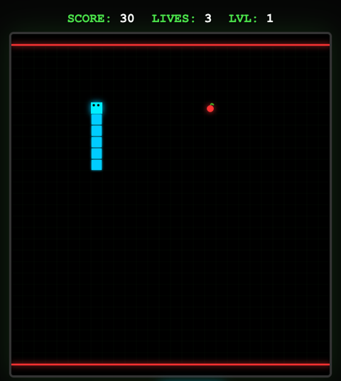<br><b>Snake</b><br><sub>Grow your snake, don't hit the walls</sub></td>
<td align="center" width="33%">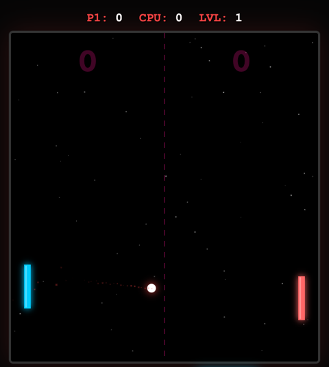<br><b>Pong</b><br><sub>Classic paddle battle — 1P vs CPU or 2P local multiplayer</sub></td>
<td align="center" width="33%">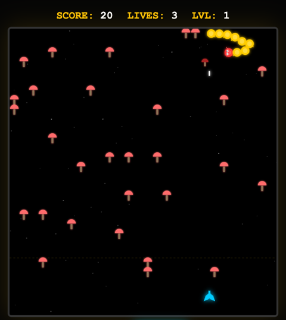<br><b>Centipede</b><br><sub>Blast the centipede through mushroom fields</sub></td>
</tr>
<tr>
<td align="center" width="33%">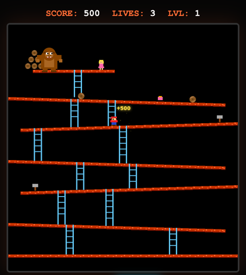<br><b>Donkey Kong</b><br><sub>Climb girders, dodge barrels, rescue Pauline</sub></td>
<td align="center" width="33%">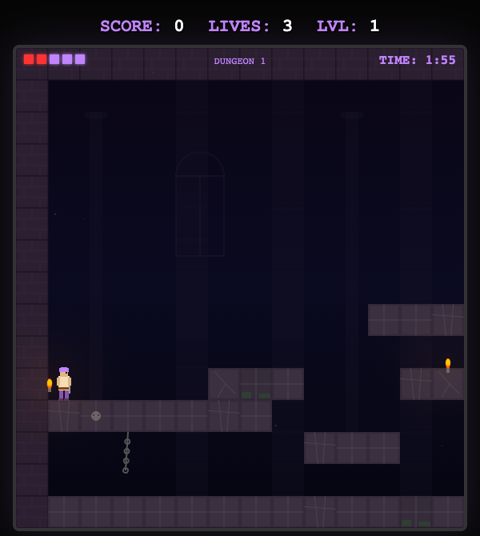<br><b>Prince of Persia</b><br><sub>Fight guards and escape the dungeon</sub></td>
<td align="center" width="33%">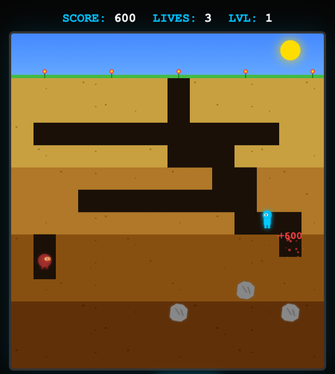<br><b>Dig Dug</b><br><sub>Tunnel underground, pump and pop enemies</sub></td>
</tr>
<tr>
<td align="center" width="33%">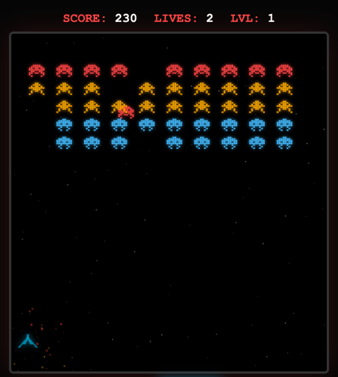<br><b>Galaga</b><br><sub>Blast diving aliens, rescue captured ships</sub></td>
<td align="center" width="33%">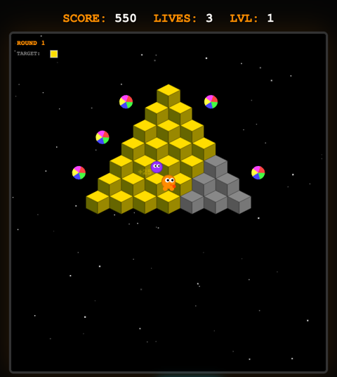<br><b>Q*bert</b><br><sub>Hop cubes, change colors, dodge Coily</sub></td>
<td align="center" width="33%">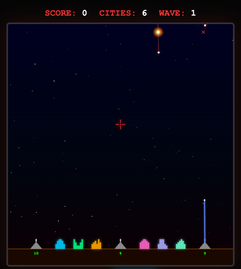<br><b>Missile Command</b><br><sub>Defend cities from nuclear annihilation</sub></td>
</tr>
<tr>
<td align="center" width="33%">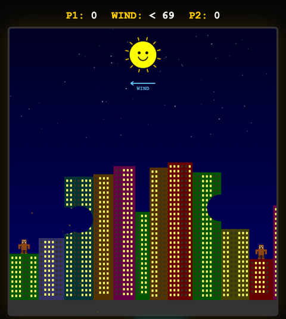<br><b>Gorillas</b><br><sub>Hurl explosive bananas across the skyline</sub></td>
<td align="center" width="33%">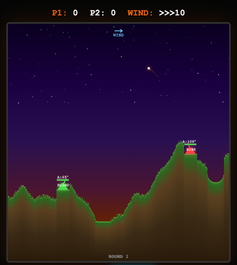<br><b>Scorched Earth</b><br><sub>Destroy terrain and blast rival tanks</sub></td>
<td align="center" width="33%">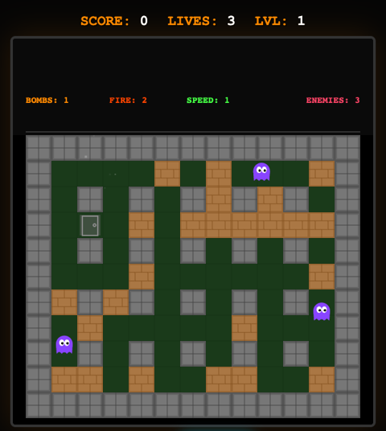<br><b>Bomberman</b><br><sub>Plant bombs, chain reactions, defeat enemies</sub></td>
</tr>
</table>

## Features

Every game includes:

- **AI Mode** — Watch the AI play any game with a single toggle
- **3 Difficulty Levels** — Easy, Medium, Hard
- **Progressive Levels** — Increasing challenge as you advance
- **Distinctive Chiptune Music** — Unique waveforms, tempos, and keys per game via Web Audio API
- **Distinctive Sound Effects** — Each game has unique sfx waveforms and patterns
- **Global Mute** — Speaker icon toggle, synced across all games via localStorage
- **High Scores** — Top 10 Hall of Fame saved to localStorage
- **Responsive Design** — Scales to any screen size, works on phones and tablets
- **Mobile Support** — Touch controls, swipe gestures, virtual joystick, action buttons, and haptic feedback
- **PWA / Install as App** — Add to home screen for a native app experience with offline support
- **Scanline Transitions** — Retro CRT-style wipe effect when navigating between pages
- **Particle Effects** — Glowing particles burst from game cards on hover
- **QR Code** — Scan the code on the index page to open on your phone
- **2-Player Pong** — Local multiplayer with P1 on arrows and P2 on W/S
- **Pause** — P key or button
- **ESC to Menu** — Press Escape on the home/game-over screen to return to the arcade menu
- **Retro Aesthetic** — Dark terminal style with neon glow effects

## Controls

| Key | Action |
|-----|--------|
| Arrow Keys | Move / Rotate |
| Space | Start / Fire / Launch / Hard Drop |
| P | Pause |
| A | Toggle AI |
| S | Toggle Sound |
| W / S | Player 1 — left paddle (Pong 2P mode) |
| Arrow Keys | Player 2 — right paddle (Pong 2P mode) |
| E / M / H | Select difficulty (on menu) |
| Escape | Return to arcade menu (on home/game-over screen) |

On touch devices, a **virtual joystick** replaces arrow keys for movement and **on-screen buttons** (FIRE, DROP, ROTATE, etc.) replace spacebar/action keys. Swipe gestures also work for directional input.

## How to Play

1. Open `index.html` in any modern browser (or visit the live site)
2. Pick a game from the arcade menu
3. Select difficulty and press Space or click Start
4. On mobile: add to home screen for the best experience

## Tech

- Pure HTML5 Canvas rendering
- Web Audio API for all sound and music
- Progressive Web App with service worker and offline caching
- No build tools, no dependencies, no server required
- Each game is a single self-contained HTML file
- Frame-rate independent game loops
- localStorage for high score and mute persistence
- Vibration API for haptic feedback on mobile
- Responsive CSS with mobile-first media queries
- GitHub Pages deployment

## Development

The games need nothing installed. To lint their JavaScript with ESLint:

```sh
npm install
npm run lint
```

## Licence

Copyright © 2026 Wayne Davies. Free software under the [GNU General Public License, version 3 or later](LICENSE).
